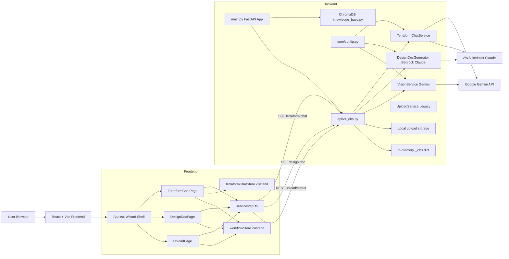
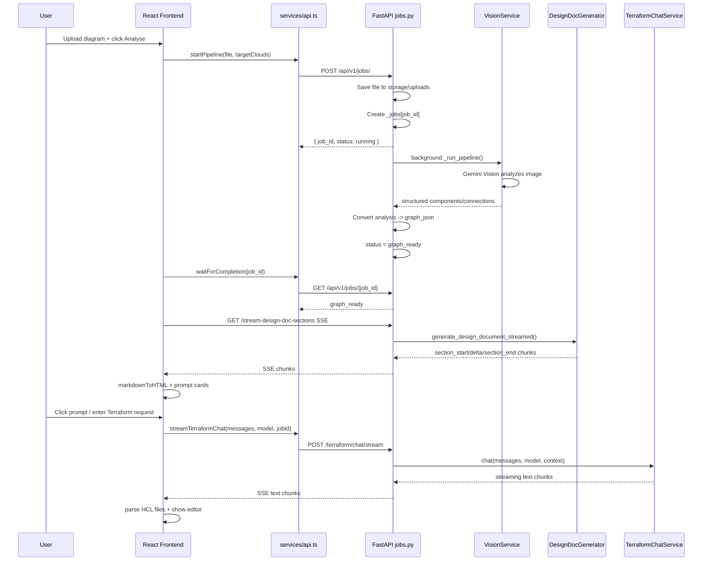
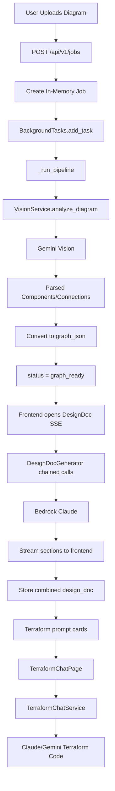
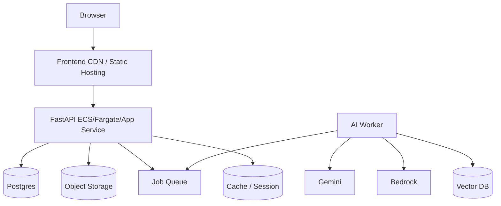
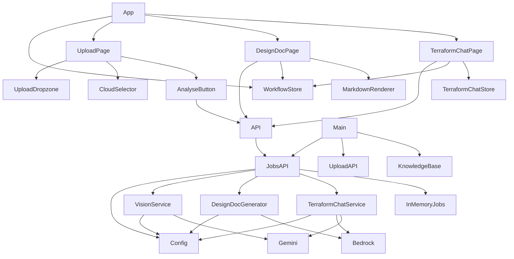

# InfraSketch / Terraform Generator — Deep Codebase Decode

This document explains the InfraSketch codebase from a senior software architect / staff engineer perspective. It is intended to onboard a new developer into the system, explain runtime flows, identify active vs legacy paths, and map how frontend, backend, AI services, and state management connect.

---

# 1. High Level Architecture

InfraSketch is an AI-powered infrastructure architecture assistant.

Its core purpose is:

- **Input:** uploaded cloud architecture diagram
- **AI stage 1:** Gemini Vision extracts components and connections
- **AI stage 2:** Claude via AWS Bedrock generates an architecture design document
- **AI stage 3:** Claude/Gemini chat generates production-ready Terraform code
- **Frontend:** guides user through Upload -> Design Document -> Terraform generation

A key thing to understand: this repository contains both **active production-path code** and some **legacy / future-facing code**. The current live path is mostly:

```text
frontend UploadPage
  -> AnalyseButton
  -> api.startPipeline()
  -> backend /api/v1/jobs/
  -> jobs.py background _run_pipeline()
  -> VisionService / Gemini Vision
  -> graph_json stored in memory
  -> DesignDocPage opens SSE /stream-design-doc-sections
  -> DesignDocGenerator / Bedrock Claude
  -> design doc + terraform prompts streamed
  -> TerraformChatPage uses prompts
  -> /terraform/chat/stream
  -> TerraformChatService
  -> generated .tf files displayed
```

## Overall Architecture Style

This is a **full-stack AI orchestration application** with:

- **React + Zustand frontend**
- **FastAPI backend**
- **in-memory job orchestration**
- **SSE streaming for long-running AI output**
- **LLM service layer**
- **local file upload storage**
- **optional / partially wired RAG layer using ChromaDB**
- **future / legacy database models using SQLAlchemy**

Architecturally, this is a **client-driven workflow system** where the frontend controls navigation and the backend holds transient job state.

The backend is not currently a durable, queue-based production system. It is closer to:

```text
FastAPI process memory = job store
BackgroundTasks = async pipeline trigger
Local disk = uploaded diagram storage
External AI APIs = intelligence layer
```

## Main Runtime Modules

| Layer | Main Files | Responsibility |
|---|---|---|
| Frontend shell | `frontend/src/App.tsx` | Wizard routing between 3 steps |
| Frontend state | `workflowStore.ts`, `terraformChatStore.ts` | Global workflow + chat/code state |
| Frontend API | `frontend/src/services/api.ts` | HTTP/SSE bridge to backend |
| Upload UI | `UploadPage.tsx`, upload components | File selection, provider selection |
| Design doc UI | `DesignDocPage.tsx` | SSE design doc streaming/rendering/prompt cards |
| Terraform UI | `TerraformChatPage.tsx` | Chat, model selection, generated file viewer |
| Backend app | `backend/app/main.py` | FastAPI bootstrap, middleware, routers |
| Backend orchestration | `backend/app/api/v1/jobs.py` | Active job API + pipeline + SSE endpoints |
| Vision AI | `vision_service.py` | Gemini image analysis |
| Design doc AI | `design_doc_service.py` | Bedrock Claude prompt chain |
| Terraform chat AI | `terraform_chat.py` | Claude/Gemini Terraform generation |
| RAG | `rag/knowledge_base.py` | ChromaDB client, mostly startup health currently |
| Legacy upload | `api/upload.py`, `upload_service.py` | Upload-only older path |

## Architecture Diagram



## Request Lifecycle Diagram



## Data Flow Diagram

```mermaid
flowchart TD
    A[Uploaded File] --> B[FastAPI /api/v1/jobs]
    B --> C[Local Disk: storage/uploads/jobid.ext]
    B --> D[_jobs[job_id] in memory]
    C --> E[VisionService]
    E --> F[Gemini Vision API]
    F --> G[Vision Analysis JSON]
    G --> H[Graph Format: nodes + edges]
    H --> D

    D --> I[DesignDocPage SSE request]
    I --> J[DesignDocGenerator]
    J --> K[Prompt Chain: Snapshot / Flows / Audit / Guidance / Terraform Prompts]
    K --> L[AWS Bedrock Claude]
    L --> M[SSE Section Chunks]
    M --> N[Frontend Markdown Renderer]
    M --> O[Prompt Parser]
    O --> P[Terraform Prompt Cards]
    N --> Q[Design Document UI]

    P --> R[TerraformChatPage]
    R --> S[Chat Messages + Context]
    S --> T[TerraformChatService]
    T --> U[Claude or Gemini]
    U --> V[Streaming Terraform Response]
    V --> W[parseResponse]
    W --> X[generatedFiles Store]
    X --> Y[Code Editor + Download]
```

---

# 2. Project Structure Explanation

## Root

```text
Terraform_generator/
├── backend/
├── frontend/
├── validation/
├── README.md
├── ARCHITECTURE.md
├── concept.md
└── decode.md
```

The repository is split into **frontend** and **backend**, with documentation and validation assets.

Important note: `README.md` and `ARCHITECTURE.md` describe a larger system than what currently exists. Some folders mentioned in docs, like full `terraform_engine`, some `agents`, and ingestion pipelines, are not active in the current runtime path. Treat those docs as **vision / previous architecture**, not current runtime truth.

## `backend/`

Purpose: server-side orchestration.

Main responsibilities:

- Accept uploads
- Track jobs
- Run Gemini Vision
- Stream design docs from Claude
- Stream Terraform chat
- Hold environment configuration
- Optionally check ChromaDB knowledge base availability

Key folders:

```text
backend/app/
├── main.py
├── api/
│   ├── upload.py
│   └── v1/jobs.py
├── core/
│   ├── config.py
│   ├── constants.py
│   └── logging.py
├── services/
│   ├── vision_service.py
│   ├── design_doc_service.py
│   ├── terraform_chat.py
│   ├── bedrock_service.py
│   └── upload_service.py
├── rag/
│   └── knowledge_base.py
├── schemas/
│   └── api_models.py
└── db/
    ├── models.py
    └── session.py
```

The backend mostly follows a **router -> service** pattern:

```text
FastAPI route = request validation + job orchestration
Service class = external AI call / business logic
Config = environment source of truth
```

There is no active repository layer because current job data is in-memory, not database-backed.

## `frontend/`

Purpose: browser UI and workflow state.

Main responsibilities:

- Upload diagram
- Display workflow state
- Start backend pipeline
- Stream design docs
- Render Markdown beautifully
- Show Terraform prompt cards
- Run Terraform chat
- Display generated `.tf` files

Key folders:

```text
frontend/src/
├── App.tsx
├── main.jsx
├── index.css
├── pages/
│   ├── UploadPage.tsx
│   ├── DesignDocPage.tsx
│   └── TerraformChatPage.tsx
├── components/
│   ├── actions/
│   ├── cloud-selector/
│   ├── common/
│   ├── upload/
│   └── workflow/
├── services/
│   └── api.ts
├── store/
│   ├── workflowStore.ts
│   └── terraformChatStore.ts
└── types/
    └── schema.ts
```

The frontend is effectively a **wizard state machine**:

```text
Step 1: Upload
Step 2: Design Doc
Step 3: Terraform
```

No React Router is used. `App.tsx` switches pages based on `workflowStore.currentStep`.

---

# 3. Complete Execution Flow

## Backend Startup

File: `backend/app/main.py`

Execution starts when Uvicorn imports:

```bash
uvicorn app.main:app --reload
```

Flow:

1. Imports `settings` from `core/config.py`
2. Creates FastAPI app
3. Adds GZip middleware
4. Adds CORS middleware
5. Includes routers:
   - `/api/upload`
   - `/api/v1/jobs`
6. Runs startup event:
   - Checks ChromaDB collection counts
   - Warns if AWS/Azure docs are not ingested
   - Does not fail app if RAG missing

Important engineering detail:

```python
app.add_middleware(GZipMiddleware, minimum_size=500)
```

This is good for normal JSON responses but dangerous for SSE if it buffers streams. The SSE endpoints explicitly set:

```python
"Content-Encoding": "identity"
```

to bypass gzip buffering.

## Frontend Startup

React mounts `App`.

`App.tsx` reads:

```ts
const { currentStep } = useWorkflowStore();
```

Then chooses page:

```text
1 -> UploadPage
2 -> DesignDocPage
3 -> TerraformChatPage
```

This is a simple **UI state machine**.

## Upload -> Vision Pipeline

Frontend path:

```text
UploadPage
  -> UploadDropzone stores file in workflowStore
  -> CloudSelector stores selected provider
  -> AnalyseButton calls api.startPipeline()
```

Backend endpoint:

```http
POST /api/v1/jobs/
```

Implemented in:

```text
backend/app/api/v1/jobs.py:create_job()
```

Important logic:

1. Validate extension
2. Generate short UUID job id
3. Save file to `settings.UPLOAD_DIR`
4. Create `_jobs[job_id]`
5. Start `_run_pipeline(job_id)` in background
6. Return immediately with `job_id`

```python
_jobs[job_id] = {
  "id": job_id,
  "filename": file.filename,
  "file_path": str(file_path),
  "target_clouds": clouds,
  "status": "running",
  "pipeline_stage": "UPLOADED",
}
```

This means the frontend can move forward without waiting for Gemini Vision synchronously.

## Background Vision Pipeline

File: `jobs.py`

```python
async def _run_pipeline(job_id: str):
```

Steps:

1. Reads uploaded file path
2. Sets stage `VISION_RUNNING`
3. Runs blocking Gemini analysis inside `asyncio.to_thread`
4. Converts vision result into graph
5. Stores graph in `_jobs[job_id]["graph_json"]`
6. Sets status `graph_ready`

Key line:

```python
vision_result = await asyncio.to_thread(_run_vision_analysis_with_raw, file_path)
```

Why this matters:

- Gemini SDK call is blocking
- Running it directly inside async FastAPI handler would block the event loop
- `to_thread` keeps the event loop responsive

## Design Doc Streaming Flow

Frontend `DesignDocPage.tsx` opens:

```ts
fetch(`/api/v1/jobs/${jobId}/stream-design-doc-sections?cloud=${cloud}`)
```

It expects SSE events:

```json
{"type":"section_start","section":"snapshot","title":"Architecture Snapshot"}
{"type":"delta","text":"..."}
{"type":"section_end","section":"snapshot"}
```

It accumulates Markdown in `markdownRef.current`, then renders to HTML via `markdownToHTML`.

Special handling:

- `terraform_prompts` raw text is **not** rendered into body
- prompts are shown as blue cards instead

Backend endpoint:

```python
@router.get("/{job_id}/stream-design-doc-sections")
async def stream_design_doc_sections(...)
```

Important internal pattern:

```python
threading.Thread(target=_produce, daemon=True)
asyncio.Queue()
```

Why?

`DesignDocGenerator` uses synchronous `boto3` Bedrock streaming. If FastAPI called it directly, it would block the event loop. So `jobs.py` bridges sync generator -> async SSE using:

```text
blocking Bedrock generator
  -> background thread
  -> asyncio.Queue
  -> StreamingResponse
```

This is a very important hidden pattern.

## Terraform Chat Flow

Frontend `TerraformChatPage.tsx`:

1. User enters prompt or clicks generated prompt card
2. `handleSend()` creates user message
3. Adds blank assistant message
4. Calls `api.streamTerraformChat(allMsgs, selectedModel, jobId)`
5. As chunks arrive:
   - updates last assistant message
   - after complete, parses files with `parseResponse()`
   - stores parsed files in `terraformChatStore.generatedFiles`

Backend endpoint:

```python
POST /api/v1/jobs/terraform/chat/stream
```

Flow:

1. Build context from `analysis_id` / job graph
2. Call `TerraformChatService.chat(...)`
3. Stream each chunk as SSE

`TerraformChatService` routes by model name:

```python
if model.startswith("claude"):
    yield from self._call_claude(...)
elif model.startswith("gemini"):
    yield from self._call_gemini(...)
```

It builds a system prompt that forces output shape:

```markdown
**1. main.tf**
```hcl
...
```

**Usage Commands**
```bash
terraform init
terraform plan
terraform apply
```
```

This format is critical because the frontend parser depends on it.

---

# 4. Data Flow Analysis

## Data Enters System

| Source | Endpoint/UI | Data |
|---|---|---|
| Uploaded file | `POST /api/v1/jobs/` | Image/PDF bytes |
| Design doc stream | `GET /stream-design-doc-sections` | job id + cloud |
| Terraform chat | `POST /terraform/chat/stream` | messages/model/job context |

## Upload Transformations

```text
File object in browser
  -> FormData
  -> FastAPI UploadFile
  -> bytes
  -> local file path
  -> _jobs[job_id].file_path
```

Validation:

- extension whitelist
- currently not full MIME sniffing
- current `jobs.py` upload path does not enforce 50MB size limit directly; legacy `UploadService` does

## Vision Transformations

```text
Image bytes
  -> Gemini Vision prompt
  -> JSON-like model response
  -> parsed analysis dict
  -> graph nodes/edges
```

Vision expected shape:

```json
{
  "components": [
    {
      "name": "...",
      "type": "...",
      "provider": "...",
      "confidence": 0.8
    }
  ],
  "connections": [
    {
      "source": "...",
      "target": "...",
      "type": "..."
    }
  ]
}
```

Graph stored as:

```json
{
  "nodes": [
    {
      "id": "...",
      "label": "...",
      "service_type": "...",
      "cloud_provider": "aws"
    }
  ],
  "edges": [
    {
      "source": "...",
      "target": "...",
      "connection_type": "..."
    }
  ]
}
```

## Design Doc Transformations

```text
graph_json
  -> components/connections reconstructed
  -> prompt templates
  -> Claude response chunks
  -> SSE deltas
  -> Markdown accumulation
  -> HTML rendering
  -> stored design_doc JSON
  -> terraform_prompts parsed separately
```

Important: `terraform_prompts` are generated as text but parsed into:

```ts
{ category: string; prompt: string }[]
```

Then UI renders cards.

## Terraform Chat Transformations

```text
User prompt + chat history
  -> backend ChatRequest
  -> context from job graph
  -> provider-specific LLM call
  -> streamed Markdown response
  -> parseResponse()
  -> generatedFiles[]
  -> code editor tabs
```

Generated file format expected:

```markdown
**1. main.tf**
```hcl
...
```
```

Frontend regex:

```ts
const fileRegex = /\*\*(\d+)\.\s+([^*]+)\*\*\s*```hcl\s*([\s\S]*?)```/g;
```

This is a tight coupling: if the LLM output format changes, parsing breaks.

---

# 5. Pipeline Explanation

## Active Pipeline



## Pipeline Stages

| Stage | Where | Status value | Purpose |
|---|---|---|---|
| Upload received | `create_job()` | `UPLOADED` | file saved, job exists |
| Vision running | `_run_pipeline()` | `VISION_RUNNING` | Gemini analyzing image |
| Graph built | `_run_pipeline()` | `GRAPH_BUILT`, `graph_ready` | structured nodes/edges ready |
| Design doc streaming | `stream_design_doc_sections()` | implicit | frontend opens SSE |
| Design doc stored | `stream_design_doc_sections()` | `DESIGN_DOC_GENERATED` | markdown + prompt cards available |
| Terraform chat | `terraform_chat_stream()` | separate chat stream | generate code |

## Retry/Error Handling

- Vision failures:
  - caught in `_run_pipeline`
  - job status set to `failed`
  - `error_message` stored

- Design doc streaming failures:
  - emitted as SSE error event
  - endpoint logs with `exc_info=True`

- Bedrock design doc `_call()`:
  - retries twice
  - returns empty string on failure

- Terraform chat:
  - frontend catches errors and appends `[Error] ...` to assistant message

## Async / Parallelism

Current system uses:

- **FastAPI BackgroundTasks** for upload -> vision
- **`asyncio.to_thread`** for blocking vision SDK call
- **thread + asyncio.Queue bridge** for Bedrock streaming
- **SSE** for frontend progressive display

There is no distributed queue like Celery/SQS. Scaling beyond one backend worker will require durable shared job storage.

---

# 6. Code Walkthrough

## `backend/app/main.py`

### Purpose

FastAPI bootstrap.

### Why it exists

Uvicorn needs an app object:

```python
app = FastAPI(...)
```

### What problem it solves

Centralizes:

- middleware
- route registration
- startup health checks

### Key logic

```python
app.add_middleware(GZipMiddleware, minimum_size=500)
```

Compression for normal responses.

```python
app.add_middleware(CORSMiddleware, ...)
```

Allows frontend dev server to call backend.

```python
app.include_router(upload.router, prefix="/api/upload")
app.include_router(jobs_v1.router, prefix="/api/v1/jobs")
```

Mounts legacy upload and active v1 jobs API.

```python
@app.on_event("startup")
async def startup_event():
```

Checks RAG collections. It does not block app startup if ChromaDB is missing.

### Security implications

- CORS origins come from config; if set too broadly in prod, cross-origin attack surface grows.
- Swagger docs enabled at `/docs`.

### Performance implications

- ChromaDB startup check can load/initialize ChromaDB.

## `backend/app/core/config.py`

### Purpose

Centralized environment config.

### Why it exists

Avoids scattered `os.environ` calls.

### Important settings

| Setting | Used by |
|---|---|
| `GEMINI_API_KEY` | `VisionService`, Gemini chat |
| `GEMINI_VISION_MODEL` | diagram analysis |
| `AWS_ACCESS_KEY_ID` / secret | Bedrock clients |
| `AWS_BEDROCK_MODEL` | design doc and Claude chat |
| `UPLOAD_DIR` | uploaded diagram storage |
| `CHROMA_PERSIST_DIR` | RAG DB path |

### Pattern

Module-level singleton:

```python
settings = Settings()
```

Every backend file imports same object.

### Security

Secrets are expected in `.env`. They should never be committed.

## `backend/app/api/v1/jobs.py`

This is the **heart of the backend**.

### Purpose

Owns:

- job creation
- job polling
- design doc download
- design doc SSE
- Terraform chat SSE
- background vision pipeline

### Important global state

```python
_jobs: dict[str, dict] = {}
```

This is the active job database.

### Singleton services

```python
_design_doc_generator = None
_vision_service = None
_terraform_chat_service = None
```

Lazy constructors:

```python
_get_design_doc_generator()
_get_vision_service()
_get_terraform_chat_service()
```

### Why singleton pattern is used

- avoids rebuilding boto3 clients repeatedly
- avoids Gemini client setup per request
- improves latency

### Risk

In-memory singleton and `_jobs` are process-local. If Uvicorn has multiple workers, each worker has different job memory.

### `create_job()`

Endpoint:

```http
POST /api/v1/jobs/
```

Input:

- multipart file
- target cloud string

Output:

```json
{
  "job_id": "...",
  "status": "running",
  "pipeline_stage": "UPLOADED"
}
```

Step-by-step:

1. Validate extension
2. Generate job id
3. Save file
4. Create `_jobs[job_id]`
5. Start `_run_pipeline(job_id)` in background
6. Return immediately

### `get_job()`

Endpoint:

```http
GET /api/v1/jobs/{job_id}
```

Returns job state.

If design docs exist, adds:

```json
"design_docs": {...}
```

### `stream_design_doc_sections()`

Endpoint:

```http
GET /api/v1/jobs/{job_id}/stream-design-doc-sections?cloud=aws
```

This is the active design doc streaming endpoint.

Critical steps:

1. Validate job exists
2. Validate graph exists
3. Convert graph nodes/edges back to vision-style components/connections
4. Create `vision_result`
5. Get singleton `DesignDocGenerator`
6. Start background thread
7. Thread runs `generate_design_document_streamed`
8. Queue forwards chunks into async SSE stream
9. While forwarding, backend accumulates section text
10. After stream ends:
    - combine sections
    - parse Terraform prompts
    - store design doc in `_jobs`

### Why thread + queue exists

Because boto3 streaming is synchronous. FastAPI endpoint is async. Blocking inside async endpoint would reduce concurrency.

### Terraform prompt parsing

The code merges continuation lines because LLM prompts can wrap:

```python
if re.match(r'^\d+\.\s*\[', stripped):
    merged_lines.append(stripped)
elif merged_lines:
    merged_lines[-1] += " " + stripped
```

Then parses:

```python
r'^\d+\.\s*\[([^\]]+)\]\s*(.+)'
```

Output:

```json
[
  {"category": "Networking", "prompt": "..."}
]
```

### `terraform_chat_stream()`

Endpoint:

```http
POST /api/v1/jobs/terraform/chat/stream
```

Input:

```json
{
  "messages": [...],
  "model": "claude-sonnet-4-6",
  "analysis_id": "jobid",
  "context": {}
}
```

If context is missing, it builds context from job graph.

Then streams:

```text
data: {"text": "..."}
data: [DONE]
```

### `_run_pipeline()`

Active background pipeline.

It currently only does:

```text
Upload -> Vision -> Graph
```

Design doc generation is on-demand via SSE.

## `backend/app/services/vision_service.py`

### Purpose

Use Gemini Vision to extract structured architecture elements from an image.

### Input

```python
image_path: str
ocr_text: str | None
```

### Output

```python
{
  "success": True,
  "analysis": {
    "components": [...],
    "connections": [...]
  },
  "raw_response": "..."
}
```

### Internal logic

1. Read image bytes
2. Build prompt
3. Send image + prompt to Gemini
4. Parse response text
5. Return normalized analysis

### Prompt responsibilities

The prompt asks Gemini to identify:

- cloud providers
- services
- network boundaries
- connections
- ports
- regions
- CIDRs
- unresolved ambiguity

### Performance

- Reads entire file into memory
- Gemini Vision call is slow and external
- This is why `jobs.py` runs it in a background thread

## `backend/app/services/design_doc_service.py`

### Purpose

Generate a professional architecture design document using Bedrock Claude.

### Why it exists

One huge prompt often produces weak output and hits token limits. This file uses **chained focused prompts**.

### Active prompt chain

| Call | Prompt | Sections |
|---|---|---|
| 1 | `SNAPSHOT_PROMPT` | Executive summary, system overview, architecture overview |
| 2 | `FLOW_PROMPT` | Data flow, security |
| 3 | `AUDIT_PROMPT` | HA, performance, cost, recommendations, scorecard |
| 4 | `GUIDANCE_PROMPT` | Terraform recommendations, ADRs, deployment |
| 5 | `TERRAFORM_PROMPTS_PROMPT` | 20 Terraform generation prompts |

### Design decision

Focused calls improve:

- output quality
- reliability
- section-specific structure
- token budget control
- streaming UX

### Key methods

#### `generate_design_document()`

Synchronous full generation. Used mostly as fallback / non-stream path.

#### `generate_design_document_streamed()`

Yields SSE-compatible strings:

```python
yield f"data: {json.dumps({'type': 'section_start', ...})}\n\n"
yield f"data: {json.dumps({'type': 'delta', 'text': text_chunk})}\n\n"
yield f"data: {json.dumps({'type': 'section_end', ...})}\n\n"
yield "data: [DONE]\n\n"
```

### Bedrock call logic

`_call_streaming()` uses:

```python
invoke_model_with_response_stream
```

Then extracts:

```python
chunk["delta"]["text"]
```

### Performance implications

- 5 sequential LLM calls
- slower than one call, but better quality
- each call has separate `max_tokens`
- Terraform prompts need higher token budget (`3500`)

## `backend/app/services/terraform_chat.py`

### Purpose

Conversational Terraform generation.

### Important method

```python
chat(messages, model, context, stream=True)
```

Routes by model:

```python
claude* -> _call_claude
gemini* -> _call_gemini
```

### System prompt

It forces:

- complete valid HCL
- file splitting
- named files
- usage commands
- CIS hardening
- concise explanations

### Hidden coupling

Frontend `parseResponse()` expects exact Markdown file format:

```markdown
**1. main.tf**
```hcl
...
```
```

If the LLM does not follow this format, the code editor gets no files.

## `backend/app/services/bedrock_service.py`

### Status

Legacy / mostly superseded.

### Purpose

Old Bedrock wrapper for single-prompt design doc generation.

### Active usage

`jobs.py` still imports and uses it in the older `/stream-design-doc` endpoint, but current frontend uses `/stream-design-doc-sections`.

### Maintenance note

This file is useful for reference but not central to current behavior.

## `backend/app/rag/knowledge_base.py`

### Purpose

ChromaDB wrapper for RAG.

### Current role

Mostly startup health check.

### It provides

- persistent Chroma client
- embedding function
- collection getter
- collection stats

### Important note

The file itself states RAG is **not wired into live code path**. The app works without it.

## `backend/app/db/models.py` and `db/session.py`

### Status

Future / not active.

### Purpose

Defines SQLAlchemy models:

- `Job`
- `Analysis`
- `DesignDoc`
- `TerraformCode`

### Problem

`session.py` references:

```python
settings.DATABASE_URL
```

But `config.py` currently has `DATABASE_PATH`, not `DATABASE_URL`.

This suggests DB layer is incomplete or stale.

## `backend/app/api/upload.py` and `upload_service.py`

### Status

Legacy upload-only path.

### Purpose

Older upload flow:

```text
POST /api/upload/
  -> save file
  -> return file_path
```

Current active flow combines upload + pipeline in `/api/v1/jobs/`.

### `UploadService`

Good separation of concerns:

- validates extension
- validates size
- writes UUID filename
- deletes file

Security strengths:

- avoids path traversal
- extension whitelist
- size cap

But active `/api/v1/jobs/` does its own upload handling and does not fully reuse this service.

---

# Frontend Walkthrough

## `frontend/src/App.tsx`

### Purpose

Root application shell.

### Why it exists

It is a lightweight router/state machine.

### Logic

```ts
currentStep === 1 -> UploadPage
currentStep === 2 -> DesignDocPage
currentStep === 3 -> TerraformChatPage
```

### Pattern

State-driven view routing without React Router.

## `frontend/src/store/workflowStore.ts`

### Purpose

Global wizard state.

### State it owns

| State | Meaning |
|---|---|
| `currentStep` | Upload / Design / Terraform |
| `selectedProvider` | `aws` / etc |
| `uploadedFile` | metadata |
| `uploadedFileObject` | actual browser File |
| `jobId` | backend job id |
| `designDocs` | backend design docs by cloud |
| `terraformPrompts` | 20 prompt cards |
| `isAnalyzing` | loading state |

### Why Zustand

Simple global state without Redux boilerplate.

## `frontend/src/store/terraformChatStore.ts`

### Purpose

State for the Terraform generation page.

### Owns

- chat messages
- generated files
- active file tab
- streaming flag
- selected model
- diagram context

### Important action

```ts
updateLastMessage(content)
```

This is used during streaming to produce a live typewriter effect.

### Persistence

Only selected model is persisted:

```ts
localStorage.setItem('infrasketch_tf_model', model)
```

## `frontend/src/services/api.ts`

### Purpose

Frontend API client.

### Important methods

#### `startPipeline(file, targetClouds)`

Calls:

```http
POST /api/v1/jobs/
```

#### `getJobStatus(jobId)`

Calls:

```http
GET /api/v1/jobs/{jobId}
```

#### `waitForCompletion(jobId)`

Polls until:

```ts
complete || design_doc_ready || graph_ready
```

Important: it returns on `graph_ready`, because design doc streaming happens later.

#### `streamTerraformChat(...)`

SSE parser for chat.

It reads chunks:

```ts
response.body.getReader()
```

and yields:

```ts
{ text: parsed.text }
```

or:

```ts
{ done: true }
```

## `frontend/src/pages/UploadPage.tsx`

### Purpose

Step 1 UI.

### Composes

- `UploadDropzone`
- `FilePreview`
- `ExtractedServices`
- `CloudSelector`
- `Notification`
- `ClearButton`
- `AnalyseButton`

### Business flow

This page prepares the minimum data needed to start backend analysis:

```text
file + cloud provider
```

## `frontend/src/pages/DesignDocPage.tsx`

This is one of the most complex frontend files.

### Purpose

Stream, render, and manage the generated architecture design document.

### Important responsibilities

1. Open SSE connection
2. Parse server-sent events
3. Accumulate Markdown
4. Render Markdown to HTML
5. Show section progress
6. Load cached design doc
7. Parse/show Terraform prompt cards
8. Navigate prompt to Terraform chat page

### Key refs

```ts
markdownRef
abortRef
timerRef
lastRenderLenRef
isStreamingRef
```

### Why refs are used

Streaming can produce many chunks. If every chunk caused React state updates, the UI would be slow. Refs allow mutable accumulation without rerendering each character.

### Throttled rendering

```ts
scheduleRender()
```

Only renders every ~80-200ms and only after enough content has changed.

### SSE parser

```ts
processBuffer(buf, onEvent)
```

Splits on `\n\n`, extracts `data:`, and passes payload to handler.

### Current important behavior

`terraform_prompts` raw text is skipped in visible Markdown:

```ts
if (activeSection !== 'terraform_prompts') {
  markdownRef.current += parsed.text;
}
```

This prevents duplicate display: raw prompt text + blue cards.

### Markdown renderer

Custom parser supports:

- headings
- tables
- callouts
- fenced code
- inferred HCL code blocks
- BEFORE/AFTER labels
- status-colored cells

### Security risk

It uses `dangerouslySetInnerHTML`. The code escapes most content with `esc()`, but custom Markdown rendering should always be treated carefully. Any path that injects unescaped LLM HTML could create XSS.

## `frontend/src/pages/TerraformChatPage.tsx`

### Purpose

Step 3: conversational Terraform generation + code editor.

### Main sections

- left chat panel
- generated prompt cards / quick starts
- model selector
- right code viewer
- generated file tabs
- copy/download/run plan buttons

### Important functions

#### `parseResponse(text)`

Extracts generated files from AI Markdown.

Input:

```markdown
**1. main.tf**
```hcl
...
```
```

Output:

```ts
{
  prose,
  files: GeneratedFile[],
  commands
}
```

#### `handleSend()`

Full request lifecycle:

1. Add user message
2. Add empty assistant message
3. Stream backend response
4. Update assistant message chunk by chunk
5. Parse final response
6. Store generated files
7. Set first active file

#### `highlightHCL()`

Frontend syntax highlighting for HCL.

### Code viewer

Uses `generatedFiles` + `activeFile`.

### Download behavior

Download button generates a combined `.tf` file using `Blob`.

### Hidden coupling

The LLM must format files exactly. If it returns plain code without markers, `generatedFiles` remains empty.

---

# 7. Business Logic Explanation

## Real-world problem

Cloud diagrams are common in architecture reviews, but translating diagrams into production Terraform requires:

- understanding services
- identifying network boundaries
- applying security best practices
- writing correct IaC
- producing design documentation
- iterating with engineers

This app automates that workflow.

## Business requirement mapping

| Requirement | Code implementation |
|---|---|
| Upload architecture diagram | `UploadDropzone`, `/api/v1/jobs/` |
| Detect services/connections | `VisionService` |
| Produce design doc | `DesignDocGenerator` |
| Generate Terraform prompts | `TERRAFORM_PROMPTS_PROMPT` |
| Generate Terraform code | `TerraformChatService` |
| Allow iteration | chat UI with message history |
| Show code like IDE | `TerraformChatPage` file viewer |
| Stream AI output | SSE endpoints + frontend readers |

## Core assumptions

- Diagram is readable enough for Gemini Vision
- LLM output follows required format
- One backend process holds job state
- User is trusted enough to run code manually after review
- AWS/Gemini keys exist in `.env`

---

# 8. Design Patterns & Engineering Decisions

## Patterns Used

| Pattern | Where | Why |
|---|---|---|
| Service Layer | `services/*.py` | isolate AI/file logic from API routes |
| Singleton / lazy init | `jobs.py`, `knowledge_base.py` | avoid repeated expensive clients |
| State machine | `App.tsx`, `workflowStore` | 3-step wizard |
| DTO / schema | `api_models.py`, frontend interfaces | typed boundaries |
| SSE streaming | design doc + chat | UX for long LLM responses |
| Thread bridge | `jobs.py` design doc stream | sync boto3 inside async FastAPI |
| Prompt chaining | `design_doc_service.py` | quality + token management |
| Adapter/router | `TerraformChatService` | route Claude vs Gemini |

## Why SSE instead of WebSockets

SSE is good here because:

- server only pushes text chunks
- browser support is simple
- easier than WebSocket lifecycle
- fits LLM streaming

WebSockets would be useful if you needed bidirectional interactive tool execution.

## Why Zustand instead of Redux

The app needs simple global state, not complex event sourcing. Zustand is enough and lower ceremony.

---

# 9. Performance Analysis

## Current bottlenecks

| Bottleneck | Cause |
|---|---|
| Gemini Vision latency | external multimodal model |
| Bedrock design doc latency | 5 sequential Claude calls |
| Terraform chat latency | streaming LLM |
| In-memory job state | not horizontally scalable |
| Markdown parsing | custom parser on large text |
| No caching across uploads | same diagram reprocessed |

## Existing optimizations

- service singleton clients
- background tasks
- `asyncio.to_thread`
- thread + queue for Bedrock stream
- throttled frontend rendering
- GZip for normal responses
- SSE streaming for UX

## Scalability limits

The biggest issue is:

```python
_jobs = {}
```

This means:

- restart loses jobs
- multi-worker breaks job lookup
- no cross-instance scaling
- no durable audit trail

## Production improvements

Recommended:

1. Move jobs to SQLite/Postgres
2. Store uploaded files in S3
3. Use Redis/Celery/SQS for background jobs
4. Add rate limiting
5. Add model response caching
6. Add structured logs / tracing
7. Persist chat sessions

---

# 10. Security Analysis

## Authentication / Authorization

Currently there is **no authentication**.

Implications:

- anyone who can access backend can upload files
- anyone can invoke expensive AI calls
- no tenant isolation
- no per-user job ownership

## Secret Management

Good:

- API keys loaded from `.env`
- no hardcoded keys in service files

Needs improvement:

- validate required keys at startup
- avoid logging sensitive config
- support cloud secret managers in production

## Upload Security

Good:

- extension whitelist
- UUID filenames in legacy upload service

Needs improvement:

- enforce size limit in active `/api/v1/jobs/`
- MIME sniffing
- malware scanning if public-facing
- PDF sandboxing concerns

## LLM Security

Risks:

- prompt injection from diagram text
- generated Terraform may create insecure resources
- user could ask model to produce dangerous infra

Mitigations needed:

- validation with Checkov/tfsec
- policy-as-code guardrails
- denylist public S3, `0.0.0.0/0` SSH, wildcard IAM
- human approval workflow

## Frontend XSS Risk

`DesignDocPage` renders generated HTML. Most text is escaped, but custom renderers using `dangerouslySetInnerHTML` require discipline.

---

# 11. Infrastructure & DevOps Flow

## Current infra

No Dockerfile or docker-compose was found.

Current dev lifecycle:

Backend:

```bash
cd backend
pip install -r requirements.txt
uvicorn app.main:app --reload
```

Frontend:

```bash
cd frontend
npm install
npm run dev
```

## Configuration

Backend uses `.env` via Pydantic settings.

## Production deployment considerations

For production, this should become:



---

# 12. AI / LLM / Agentic Logic

## Vision AI

`VisionService` acts like a specialized diagram extraction agent.

It turns visual architecture into structured graph-like data.

Prompt asks for:

- services
- connections
- boundaries
- ports
- metadata
- unresolved ambiguity

This is the perception layer.

## Design Doc AI

`DesignDocGenerator` acts like a principal architect.

It uses prompt decomposition:

```text
Snapshot prompt
Flow/security prompt
Audit prompt
Guidance prompt
Terraform prompt generation prompt
```

This is a **pipeline of role-specialized reasoning calls**, not a single agent loop.

## Terraform Prompt Generation

The 5th design doc call creates 20 prompt cards. These are not Terraform code yet. They are high-quality instructions to feed into the Terraform chat step.

This creates a UX split:

```text
Design doc explains architecture
Prompt cards convert architecture into actionable IaC tasks
Terraform chat generates actual files
```

## Terraform Chat AI

`TerraformChatService` is an AI coding assistant specialized for Terraform.

Its system prompt enforces:

- valid HCL
- named files
- CIS hardening
- usage commands
- concise explanation

## RAG

ChromaDB exists but is not active in the live generation path. It is currently more of a planned/future capability.

---

# 13. Relationship Mapping

## Dependency Graph



## API Interaction Map

| Frontend method | Backend endpoint | Purpose |
|---|---|---|
| `startPipeline()` | `POST /api/v1/jobs/` | upload + start vision |
| `getJobStatus()` | `GET /api/v1/jobs/{id}` | poll job |
| `waitForCompletion()` | repeated GET | wait until graph/design ready |
| DesignDocPage direct fetch | `GET /stream-design-doc-sections` | stream sections |
| `streamTerraformChat()` | `POST /terraform/chat/stream` | stream Terraform generation |
| `downloadDesignDocPdf()` | `GET /design-doc/{cloud}` | actually markdown download despite name |

---

# 14. Learning Mode

## Recommended Reading Order

If you joined this project today, read in this order:

1. `README.md`
2. `frontend/src/App.tsx`
3. `frontend/src/store/workflowStore.ts`
4. `frontend/src/pages/UploadPage.tsx`
5. `frontend/src/components/actions/AnalyseButton.tsx`
6. `frontend/src/services/api.ts`
7. `backend/app/main.py`
8. `backend/app/api/v1/jobs.py`
9. `backend/app/services/vision_service.py`
10. `backend/app/services/design_doc_service.py`
11. `frontend/src/pages/DesignDocPage.tsx`
12. `frontend/src/pages/TerraformChatPage.tsx`
13. `backend/app/services/terraform_chat.py`
14. `rag/knowledge_base.py`
15. legacy files (`bedrock_service`, `upload.py`, `db/*`)

## Where Beginners Get Confused

### 1. The design doc is not generated during upload

Upload only runs vision and builds graph. Design doc streams later from `DesignDocPage`.

### 2. There are two design doc stream endpoints

- `/stream-design-doc` = older / legacy
- `/stream-design-doc-sections` = active

### 3. RAG is present but not actually wired

Startup checks ChromaDB, but current generation mostly relies on prompts/templates.

### 4. Terraform prompts are not Terraform code

They are instructions shown as cards.

### 5. Frontend parsing depends on LLM formatting

If Claude/Gemini changes output format, generated files may not parse.

### 6. `_jobs` is not database storage

Refreshing backend loses job state.

## Dangerous Areas

| Area | Why dangerous |
|---|---|
| `jobs.py` SSE stream | async/threading/state interaction |
| `DesignDocPage.tsx` Markdown renderer | XSS/performance risk |
| `TerraformChatPage.parseResponse()` | brittle regex |
| prompt templates | small changes can break UI parsing |
| `_jobs` memory | production durability issue |
| `db/session.py` | stale config reference |

## Debugging Strategy

### If upload fails

Check:

- browser network tab
- `/api/v1/jobs/` response
- backend logs
- file extension
- `UPLOAD_DIR`

### If vision fails

Check:

- `GEMINI_API_KEY`
- file exists
- Gemini model name
- backend log `[VisionService]`

### If design doc does not stream

Check:

- job status is `graph_ready`
- `graph_json` exists
- `/stream-design-doc-sections`
- Bedrock credentials
- SSE buffering headers

### If prompts duplicate

Check:

- `DesignDocPage` skipping `terraform_prompts` raw body
- cached content stripping

### If Terraform code tabs empty

Check:

- assistant message contains `**1. filename.tf**`
- code fences are ```hcl
- `parseResponse()` regex

---

# 15. Final Summary

## How the entire system works

InfraSketch is a three-step AI-assisted IaC generation system:

1. **Upload**
   - User uploads architecture diagram
   - Backend stores file
   - Gemini Vision extracts components/connections
   - Backend stores graph in memory

2. **Design document**
   - Frontend opens SSE stream
   - Backend reconstructs vision context
   - Claude via Bedrock generates architecture sections
   - Frontend renders polished design doc
   - Backend parses 20 Terraform generation prompts
   - Frontend shows prompts as cards

3. **Terraform generation**
   - User clicks prompt or chats
   - Backend builds diagram context
   - Claude/Gemini generates Terraform
   - Frontend parses files and displays code editor

## Core Architecture Philosophy

The system favors:

- **fast UX through streaming**
- **LLM prompt decomposition**
- **simple local development**
- **frontend-driven workflow state**
- **service-layer AI integrations**
- **progressive enhancement of generated content**

## Strengths

- Clean current user workflow
- Good separation between frontend pages and backend services
- SSE streaming gives strong UX
- Prompt chain is better than one giant prompt
- Zustand state is simple and effective
- Lazy service singletons reduce latency
- Terraform prompt cards are a strong product idea

## Weaknesses

- In-memory job store is not production durable
- No authentication / authorization
- RAG mostly not active
- DB layer incomplete/stale
- LLM output parsing is regex-dependent
- No Terraform validation pipeline wired into active flow
- Some docs describe future architecture, not current implementation
- Upload security needs stronger active enforcement

## Scalability Maturity

Current maturity: **prototype / strong MVP**

To become production-grade:

- replace `_jobs` with Postgres/Redis
- move uploads to object storage
- introduce queue workers
- add auth and per-user job isolation
- add rate limiting
- validate generated Terraform
- persist chat/design outputs
- add observability/tracing
- wire RAG into prompt context properly

## Engineering Quality

The current active path is understandable and pragmatic. The biggest engineering concern is that some legacy/future files remain beside active code, which can confuse maintainers. The most important production refactor would be:

```text
jobs.py orchestration
  -> durable job repository
  -> worker queue
  -> service-layer pipeline
  -> persistent design docs / chat sessions
```

As an AI-driven local/dev workflow, the architecture is coherent and already has good foundations: service abstractions, streaming, state separation, and clear pipeline stages.
